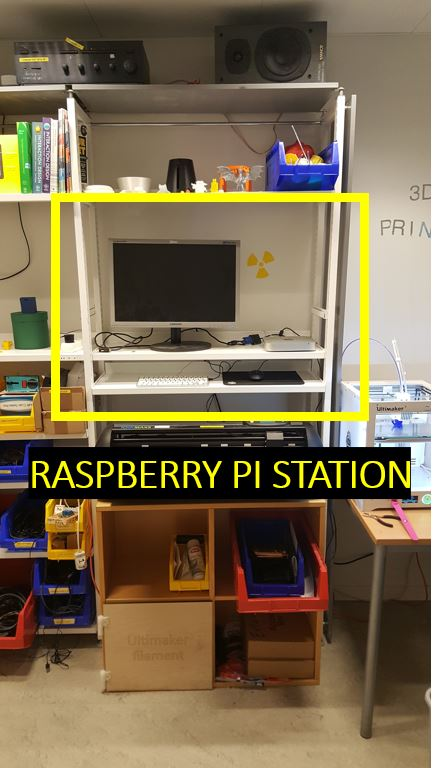

[Tilbage til Forsiden](../../master)

## Hvad skal du bruge

### Hardware:
* 1x Raspberry Pi
* 1x Computer med SD-Kort læser
* 1x Micro-SD Kort
* 1x SD-Kort adapter

### Software:
* 1x Raspberry Pi Styrresystem (Eksempelvis: Raspbian)
* 1x SD Kort brænder (Eksempelvis: Balena Ethcer)


## Installation af Raspberry Pi
Ved siden af vores to 3D-printere har lavet en Pi-arbejdsstation bestående af en Raspberry Pi 3, en skærm, tastatur og mus.
Der kan man sætte et SD-kort i en Pi (eller sætte en anden Pi til) for at sætte sit system op. Detaljerne om dette står herunder.



### Download Styresystem
  
Der findes flere forskellige styresystemer til RP (Raspberry Pi), men et godt sted at starte er [Raspian](https://www.raspberrypi.org/downloads/raspbian/ "Raspian download page") og hvad denne guide tager udgangspunkt i.
Man kan også downloade [NOOB (New Out Of the Box Software)](https://www.raspberrypi.org/downloads/noobs/ "NOOB download page") som er anbefalet til nybegyndere og giver mulighed for at installere andre styresystemer.
Til hurtig start anbefaler vi at du henter Desktop versionen af Raspian styresystemet.

### Installere OS til SD-kortet
For at installere styresystemet på SD-kortet skal du bruge et program der kan gemme det på kortet - på samme måde som du måske i tidernes morgen har prøvet at brænde CD'er eller DVD'er. Det program vi anbefaler at bruge er
[Etcher](https://etcher.io/ "Etcher webpage") hvilket er et cross platform og nemt at gå til.

### Boot styresystem
Sæt SD-kortet i en Raspberry Pi ved Pi-stationen og sæt strøm til RP'en. Nu burde Raspberry Pien tænde og Raspian styresystemet starte op.

### Opdatere styresystem
For at sikre at Pi'en har de nyeste opdateringer kan man åbne terminalen  ved at trykke på ikonet i venstre top på ikonet med `>_`. Skriv derefter følgende:

```
sudo apt-get update
sudo apt-get upgrade
```
Dette gør at Raspberry Pi'en henter de seneste opdateringer af drivers og programmer og installerer dem på systemet.
Det kan tage et godt stykke tid, så hav lidt tålmodighed. Vi anbefaler at du bruger ovenstående kommandoer regelmæssigt (Gerne en gang om måneden) så systemet altid er up-to-date.

### Opsætning af WiFi
Detaljeret guide kan findes [her](https://www.raspberrypi.org/documentation/configuration/wireless/wireless-cli.md "WiFi setup"). Raspberry Pi kan forbindes til almindelige 2,4GHz WiFi, der er dog problemer med at komme på eduroam.

Skriv følgende i terminalen
```
sudo nano /etc/wpa_supplicant/wpa_supplicant.conf
```
Nederst i filen der åbnes skal der skrives følgende
```
network={
    ssid="wifi navn"
    scan_ssid=1
    psk="wifi kode"
}
```
For at lukke filen trykkes der `Ctrl+x`, `Y` og så `Enter`.
Linjen `scan_ssid` kan undlades, men er anvendelig, hvis man vil forbinde til et gemt netværk.

Skriv dernæst `sudo reboot now` for at genstarte og ændringerne træder i kraft.

### Afslutning

Nu burde din raspberry pi være up-to-date og køreklar til dit projekt.

[Tilbage til Forsiden](./)
